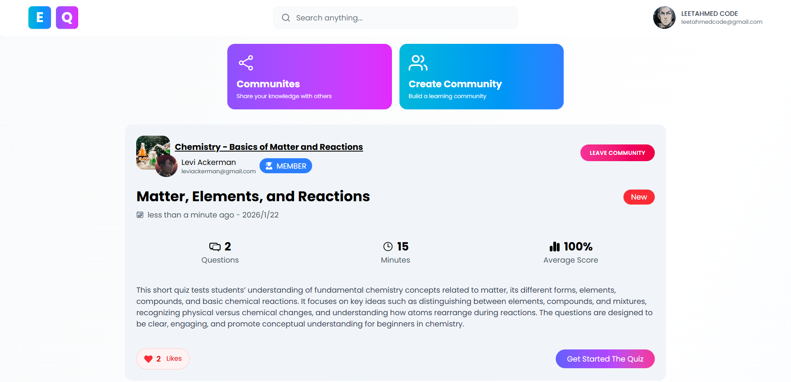
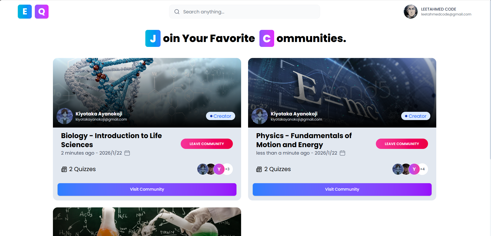
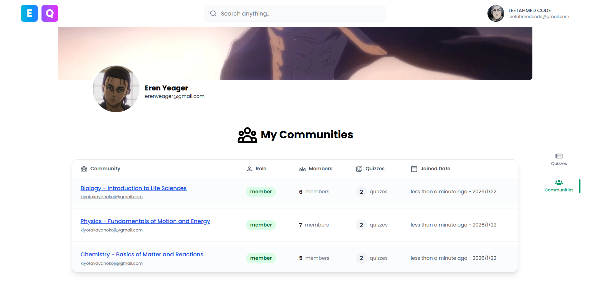
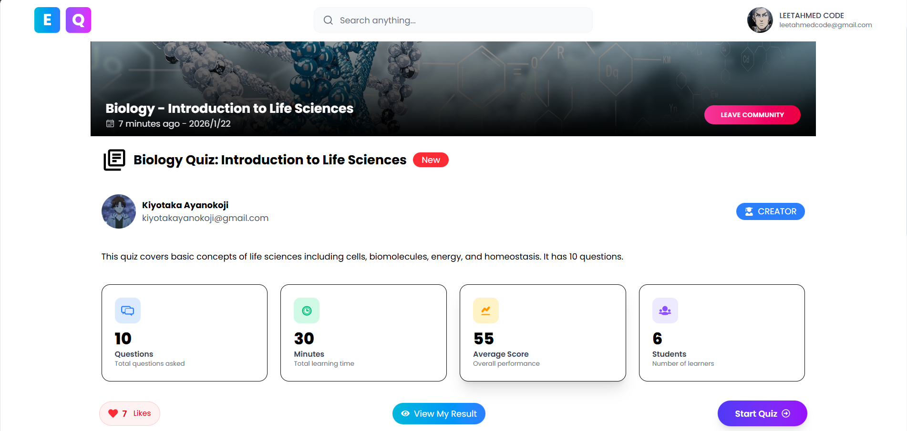
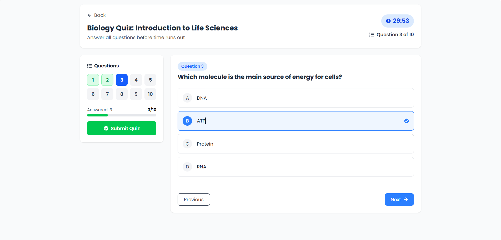
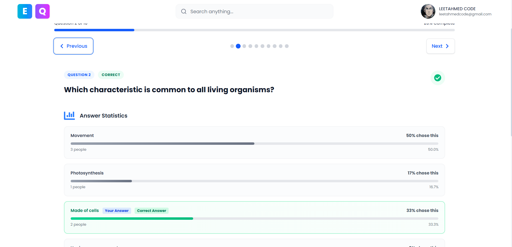
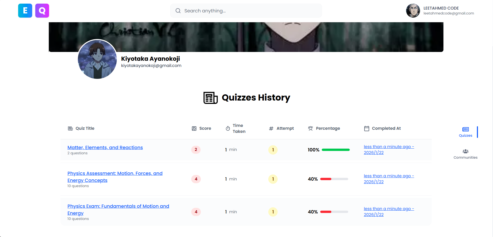
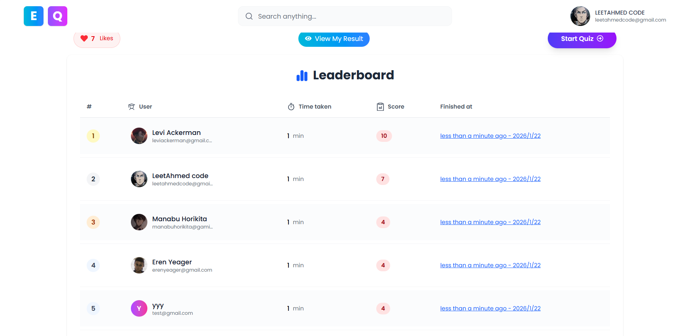

# 🌍 EcoQuiz

EcoQuiz is a modern, interactive quiz platform designed to make learning fun and engaging. Users can join communities, participate in quizzes, track their progress, and compete on leaderboards. This project leverages a robust Go backend and a dynamic React frontend to deliver a seamless user experience.

## 🚀 Features

- **User Authentication:** Secure registration and login system.
- **Community Management:** Join and explore various communities of interest.
- **Interactive Quizzes:** Take quizzes with a timer and instant feedback.
- **Leaderboards:** Compete with other users and see top performers.
- **History & Analytics:** Review your past quiz attempts and performance.
- **Responsive UI:** A beautiful, fully responsive interface built with TailwindCSS.

## 🛠️ Technology Stack

### Backend
- **Language:** [Go](https://go.dev/) (v1.25.5)
- **Framework:** [Gin Web Framework](https://github.com/gin-gonic/gin)
- **Database:** PostgreSQL
- **Driver:** [pgx](https://github.com/jackc/pgx)
- **Authentication:** JWT (JSON Web Tokens) & OAuth2

### Frontend
- **Framework:** [React](https://react.dev/) (v19)
- **Build Tool:** [Vite](https://vitejs.dev/)
- **Styling:** [TailwindCSS](https://tailwindcss.com/) (v4)
- **Language:** TypeScript

## 📸 Screenshots

### Home Page
The landing page of EcoQuiz where users can discover new quizzes and communities.


### Communities
Explore and join different communities to access specific quizzes.


### User Community View
View details of a specific community and its available quizzes.


### Quiz Details
Get detailed information about a quiz before starting it.


### Taking a Quiz
An interactive interface for answering quiz questions.


### Results Page
Instant results and feedback after completing a quiz.


### Quiz History
Track your past performance and review previous attempts.


### Leaderboard
See where you stand among other quiz takers.


## 🏁 Getting Started

Follow these instructions to set up the project locally.

### Prerequisites

- Go 1.25 or higher
- Node.js & npm (or yarn/pnpm)
- PostgreSQL database

### Backend Setup

1.  **Clone the repository:**
    ```bash
    git clone <repository-url>
    cd EcoQuiz
    ```

2.  **Environment Variables:**
    Copy the `.env.example` file to `.env` and configure your database and JWT credentials.
    ```bash
    cp .env.example .env
    ```

3.  **Install Dependencies:**
    ```bash
    go mod download
    ```

4.  **Run the Server:**
    ```bash
    go run cmd/main.go
    ```
    The backend server will start on the port specified in your `.env` file (default is usually 8080).

### Frontend Setup

1.  **Navigate to the frontend directory:**
    ```bash
    cd frontend
    ```

2.  **Install Dependencies:**
    ```bash
    npm install
    ```

3.  **Run the Development Server:**
    ```bash
    npm run dev
    ```
    The application will be accessible at `http://localhost:5173` (or the port shown in your terminal).

## 📂 Project Structure

```
EcoQuiz/
├── cmd/                # Application entry points (main.go)
├── internal/           # Private application and library code
│   ├── handlers/       # HTTP request handlers
│   ├── models/         # Database models
│   ├── routes/         # API route definitions
│   └── services/       # Business logic services
├── frontend/           # React frontend application
│   ├── src/            # Source code
│   ├── public/         # Public assets
│   └── ...
├── images/             # Project screenshots
├── uploads/            # User uploads (avatars, etc.)
└── ...
```

## 🤝 Contributing

Contributions are welcome! Please fork the repository and create a pull request with your changes.

## 📄 License

This project is licensed under the MIT License.
